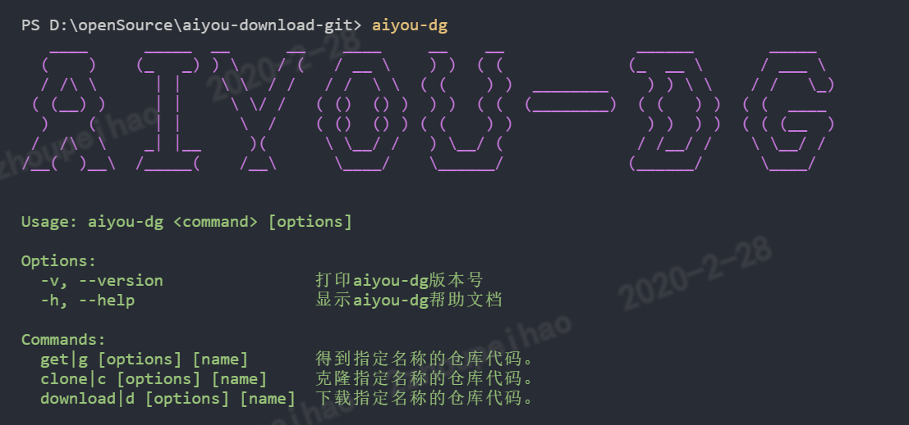
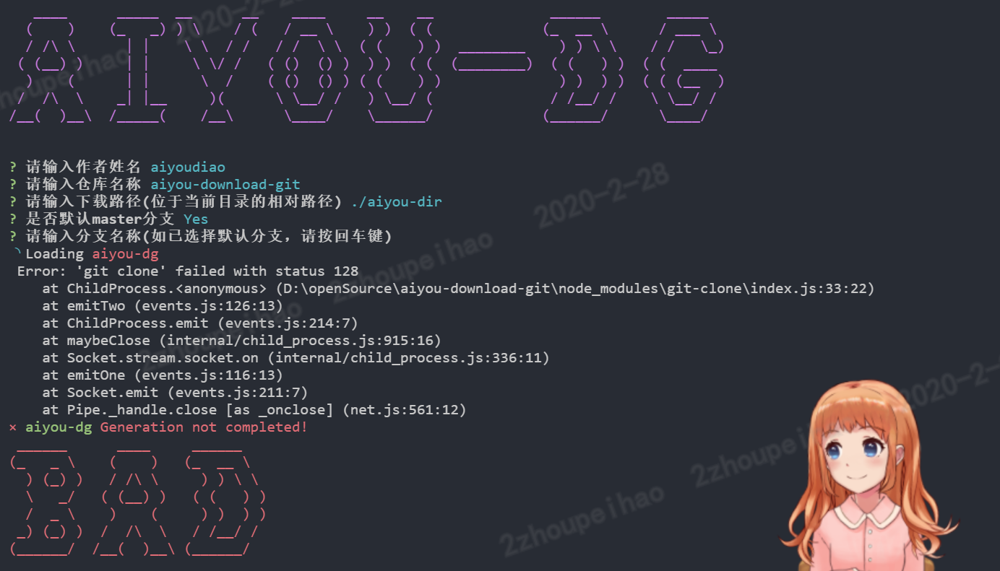

<p align="center">
    
</p>

# aiyou-download-git（超轻量 Git Repository 下载工具）- 哎呦系列


- [🔥 功能列表](##功能列表)
- [✨ 使用介绍](#使用介绍)
- [🚀 快速上手](#快速上手)
- [📚 开发文档](#开发文档)
- [📞 社区交流](#社区交流)

---

## aiyou-download-git 是什么鬼？

aiyou-download-git 是**哎呦系列**中，用于拉取远程或本地的 Repository 代码并且支持下载 Repository 的压缩包的工具包。

- ✂️ 轻量：`ES6`class 代码编写，有良好的`jsdoc`注释，后续会添加`jest`单元测试以及`typescript`支持。
- ⚡ 易用：交互式操作，可作为命令行工具来全局使用，也可作为第三方依赖包使用。
- 💉 高效：支持多种 git 仓库及本地 git 仓库的源码或压缩包下载。
- ⚙️️ 简单: 只有 3 个 api，分别是 get、clone、download，命令行工具也如此。

| nodejs | npm   | size   |
| ------ | ----- | ------ |
| > 8.0  | > 6.0 | 我管它 |

## 🔥 功能列表

aiyou-download-git 程序，可以同时运行在 windows 和类 unux 的电脑中：

| api                                   | 效果                                                               |
| ------------------------------------- | ------------------------------------------------------------------ |
| aiyou-dg                              | 打开 aiyou-download-git 程序的帮助文档                             |
| aiyou-dg get 仓库所有者/仓库名称      | 获取一份 github 上该所有者的指定仓库名称的代码                     |
| aiyou-dg clone 仓库所有者/仓库名称    | 克隆一份 github 上该所有者的指定仓库名称 master 分支上的代码       |
| aiyou-dg download 仓库所有者/仓库名称 | 下载一份 github 上该所有者的指定仓库名称 master 分支上的代码压缩包 |
| ...                                   | 后续功能待优化                                                     |

---

## ✨ 使用介绍

### ⚔️ 安装指南

全局安装：

```bash
    npm install -g aiyou-dg
```

---

作为第三方依赖安装：

```bash
    npm install aiyou-dg
```

### 📈 使用方法

全局使用（全局安装后的使用方式），在命令行工具中逐行输入以下命令：

```bash
    mkdir temporary-directory
    cd temporary-directory
    aiyou-dg
```

---

局部使用（作为第三方依赖包来使用），在 node 环境下的 js 文件中复制以下代码进行粘贴：

```javascript
const AiYouDownloadGit = require ('aiyou-dg');
const aiyouDG = new AiYouDownloadGit ();

aiyouDG.get ({
    /* github上 该仓库的所有者/该仓库名称 */
    currentUrl: 'aiyoudiao/aiyou-download-git',
    /* 指定存放目录，可相对路径也可绝对路径 */
    targetPath: './temp/aiyou-download-git',
    /* 其它相关选项，一般可不动它*/
    option: {
        git: 'git',
        mode: 'clone',
        branchName: 'master',
        depthOne: false
    }).then(() => {
        // 获取代码成功之后做些啥...
        console.log('SUCCESS!')
    }).catch((reason)=> {
        // 获取代码失败之后做些啥...
        console.error(reason)
    });

```

---

### 😎 浮夸的效果



---

## 🚀 快速上手

**安装**->**使用**

## 📚 开发文档

aiyou-download-git 是最简单，易用的获得 Repository 仓库代码的工具。

## 代码仓库

[github 链接](https://github.com/aiyoudiao/aiyou-download-git)

## 📞 社区交流

aiyou-download-git 是**哎呦系列**中一员，之后还会有其它的成员陆续上来。
加群交流：756892437


### 感谢以下开源工具

- chalk
- commander
- cli-spinners
- figlet
- inquirer
- ora
- yargs
